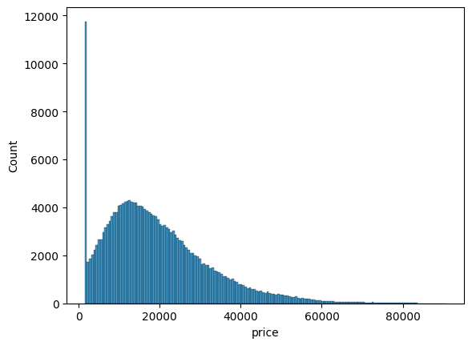
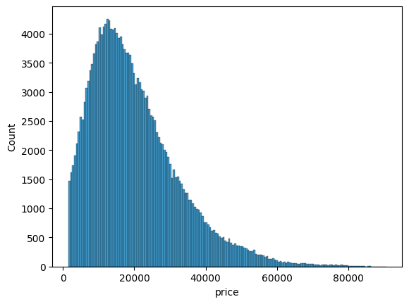
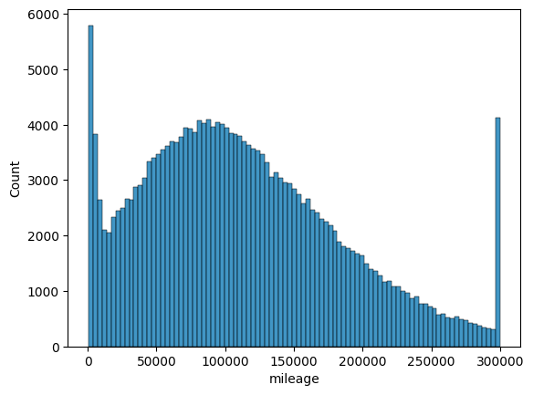
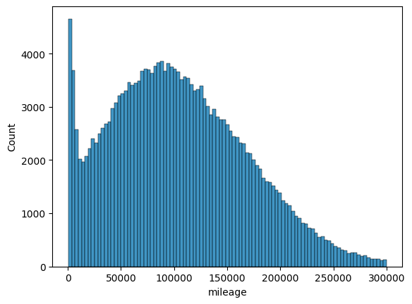
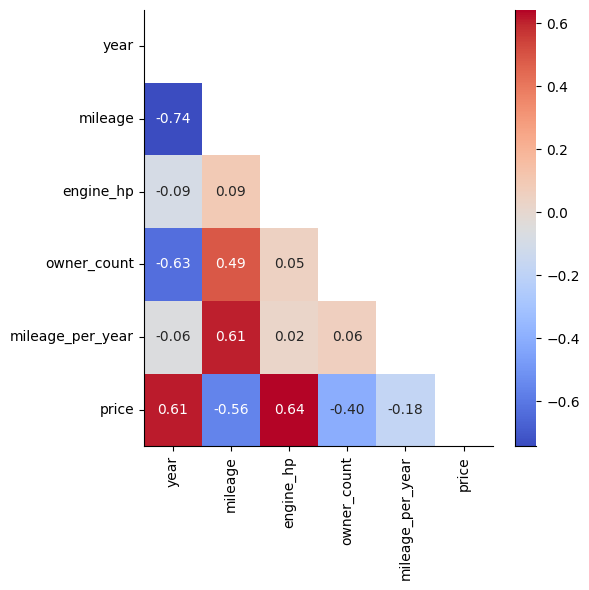
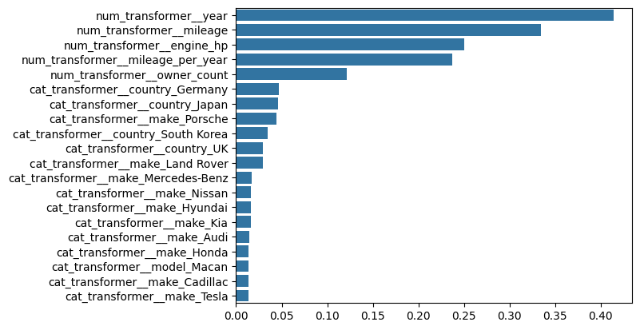
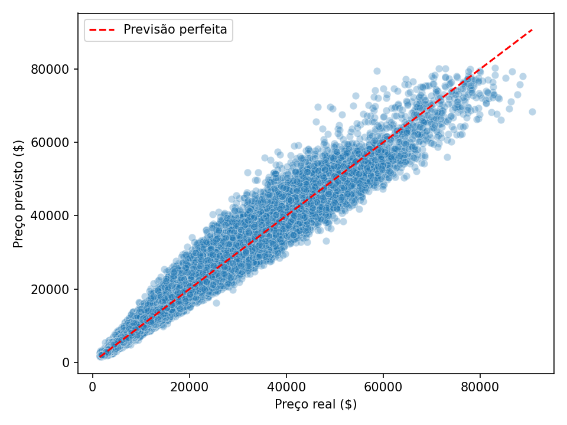

# Previsão de preços para carros usados
Projeto de regressão para prever o preço de venda de veículos usados com base em suas características. Foi feita uma exploração dos dados usando SQL e, posteriormente, uma análise exploratória e modelagem com Python.

Tudo foi feito utilizando um dataset retirado do kaggle
[(https://www.kaggle.com/datasets/metawave/vehicle-price-prediction).

## Setup
### Linguagem
- Python 3.13+

### Dependências
- **Manipulação de Dados**: Pandas, Numpy
- **Machine Learning**: Scikit-Learn
- **Visualização**: Matplotlib, Seaborn
- **Logs das Métricas**: mlflow

---

## Estrutura
```
car_price/
│
├── assets/                    --> Imagens usadas no README
├── data/
│   ├── new_data.csv           --> Dados novos
│   ├── pc_cleaned.csv         --> Dataset alterado no SQL
│   └── price_cars.csv         --> Dataset completo
├── models/                    --> Arquivos .pkl do modelo  
├── notebook/
│   ├── 01_queries_SQL.ipynb   --> Queries SQL
│   ├── 02_eda.ipynb           --> Análise exploratória
│   ├── 03_modeling.ipynb      --> Testes do modelo
├── README.md
├── requirements.txt           --> Dependências
├── sql/                       --> Databases sql
│   └── price_cars.db          
└── src/                       --> Arquivos finais
    ├── predict.py
    └── train.py

```

---

## Dados

O dataset contém ~200000 registros sintéticos, ou seja, foram criados artificialmente.
| Coluna | Descrição |
|-|-|
|`make`|Marca|
|`model`|Modelo|
|`year`|Ano de fabricação|
|`mileage`|Quilometragem (em milhas)|
|`engine_hp`|Potência (HP)|
|`transmission`|Tipo de câmbio|
|`fuel_type`|Tipo de combustível|
|`drivetrain`|Tipo de tração|
|`body_type`|Tipo de carroceria|
|`condition`|Estado de condição|
|`vehicle_age`|Idade do veículo|
|`mileage_per_year`|Quilometragem por ano|
|`seller_type`|Tipo de vendedor (concessionária/individual)|
|`price`|Preço (Dólares)|

---

## Metodologia
### 1. Exploração SQL (01_queires_SQL.ipynb)
A exploração inicial foi feita no SQL, incluindo:
- Quantidade de marcas e quais são elas.
- Distribuição de marcas, modelos, tipo de transmissão e países de origem.
- Preço médio por tipo de combustível, país de origem e tipo de vendedor.
- Marcas com melhor relação peso/potência.
- Verificação de comportamentos em relação à idade do carro.
- Ranking de quantidade de veículos vendidos por cada marca.

Foi criada uma tabela auxiliar `brand_origin` relacionando cada marca com seu país de origem, utilizada com um JOIN para análises geográficas.

Ao fim da exploração foi criado um arquivo .csv novo, contendo alguns filtros que removem dados que, por se tratar de dados sintéticos, podem ser inconsistentes com a realidade.

Os filtros removem:
- Tesla com ano anterior a 2008, combustível não-elétrico ou câmbio manual.
- Marcas que nunca fabricaram carros a diesel e apresentam registros com este tipo de combustível (Lexus, Acura, Subaru).
- Modelos elétricos de marcas antes do ano de lançamento real do modelo.
- Registros com `mileage_per_year` > 35.000 (uso irreal).
- Registros com `price` = 1.500 exato foram removidos — valor claramente artificial, sem variação natural nos dados.
- Registros com `mileage` = 500 e `mileage` = 300.000 foram removidos — ambos os limites são artificiais, sem variação nos dados nos limites.

|Coluna| Antes | Depois |
|-|-|-|
|price|  | |
|mileage| |  |

---

### 2. Análise exploratória (02_eda.ipynb)
Correlação entre as variáveis numéricas:


Principais correlações com `price`:

- `engine_hp` (+0.64): maior potência, maior preço
- `year` (+0.61): carros mais novos valem mais
- `vehicle_age` (-0.61): correlação inversa esperada com `year`
- `mileage` (-0.56): maior quilometragem, menor preço
- `owner_count` (-0.40): mais donos anteriores, menor preço

---

### 3. Modelagem (03_modeling.ipynb)
**Pipeline:**
 
```
Dados → Pré-processamento → Target encoder → SelectKBest (k=20) → Modelo → TransformedTargetRegressor (log1p/expm1)
```
 
- **Numéricas:** StandardScaler
- **Categóricas:** OneHotEncoder
- **Target:** `log1p(price)` no treino, revertido com `expm1` no final
- **Split:** 70/30 estratificado por `body_type`
- **Validação:** Cross-validation com 3 folds (MAE)

---

## Resultados
### Baseline — Regressão Linear
**Melhores 20 features:**

 
| Métrica | Treino | Teste |
|---|---|---|
| MAE | $2818 | $2831 |
| RMSE | $3811 | $3834 |
| MAPE | 20.05% | 20.10% |
| R² | 0.9066 | 0.9066 |
| CV MAE (3-fold) | $2818 | — |
 
A similaridade entre treino e teste indica ausência de overfitting. O MAPE de ~20% e R² de 0.906 como baseline linear — sem encoding da coluna `model` e sem ajuste de hiperparâmetros — estabelece um ponto de referência sólido para os próximos modelos.

### Random Forest
Além da mudança de modelo, foi adicionado **target encoding** na coluna `model`, em vez do OneHotEncoding. Na regressão linear o encoding piorou o MAPE de ~20% para ~30%, indicando que a relação entre o modelo do veículo e o preço não é linear.

| Métrica | Treino | Teste |
|---|---|---|
| MAE | $1.591 | $1.615 |
| RMSE | $2.404 | $2.431 |
| MAPE | 8,53% | 8,61% |
| R² | 0.9650 | 0.9644 |
| CV MAE (3-fold) | $1.629 | — |

A proximidade entre o CV MAE ($1.629) e o MAE do teste ($1.615) confirma que o modelo generaliza bem para dados não vistos. A queda no MAPE de ~20% para ~8% reflete a capacidade do Random Forest de capturar relações não-lineares entre as features e o preço.



## Reprodução

### 1. Clone o repositório
```bash
git clone https://github.com/henryShoiti/car_price.git
cd car_price
```

### 2. Crie a pasta para os modelos salvos
```bash
mkdir models
```

### 3. Crie e ative o ambiente virtual
```bash
python -m venv .venv
```

Linux/Mac:
```bash
source .venv/bin/activate
```

Windows:
```bash
.venv\Scripts\activate
```

### 4. Instale as dependências
```bash
pip install -r requirements.txt
```

### 5. Inicie o mlflow
```bash
mlflow ui
```
Acesse o log dos treino em http://localhost:5000/ pelo navegador

### 6. Treine o modelo
```bash
cd src
python train.py
```
O modelo será salvo em `models/random_forest.pkl`.

### 7. Realize previsões
O arquivo `data/new_data.csv` contém exemplos de dados novos para teste. Para usar seus próprios dados, substitua o caminho em `predict.py`(linha 10):

```python
csv_path = '../data/seu_arquivo.csv'
```

Então execute:
```bash
python predict.py
```
